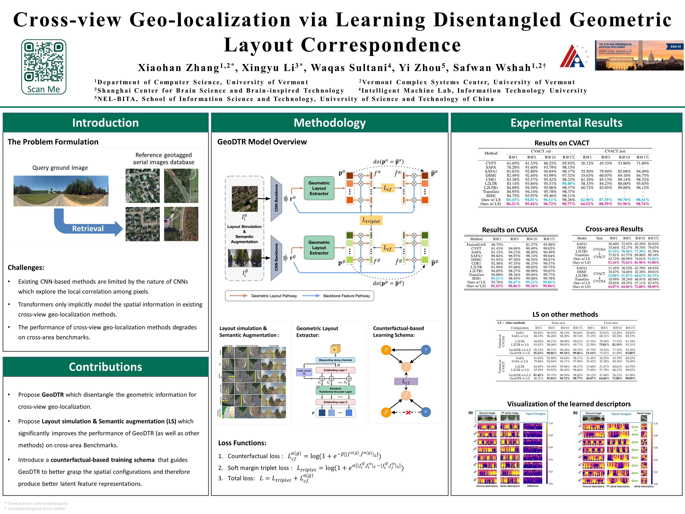

## Implementation for "Cross-view Geo-localization via Learning Disentangled Geometric Layout Correspondence"

[[Paper]](https://arxiv.org/pdf/2212.04074.pdf)
[[Slides]](./resources/AAAI_presentation.pdf)



### Prerequisites
---
1. numpy
2. Pytorch >= 1.11
3. torchvision >= 0.12
4. tqdm
5. scipy
6. PIL


### Dataset
---
#### CVUSA

- We obtain the permission of CVUSA dataset from the owner by submit the [MVRL Dataset Request Form](https://mvrl.cse.wustl.edu/datasets/cvusa/).
- Please refer to the repo: [https://github.com/viibridges/crossnet](https://github.com/viibridges/crossnet)

#### CVACT

- We obtain the permission of CVACT dataset by contacting the author directly.
- Please refer to the repo: [https://github.com/Liumouliu/OriCNN](https://github.com/Liumouliu/OriCNN)

#### Pre-processing

To prepare data, we follow the method of [SAFA](https://github.com/shiyujiao/cross_view_localization_SAFA). Before running the code, one should pre-process the dataset with the provided file `data_preparation.py`.

#### Check duplicate images in CVUSA

To get the duplicate images in CVUSA dataset as reported in the main paper. Please change the directory in line 7 of `check_cvusa_duplicate.py` and run it to check duplicate files. A json file with all duplicate pairs will be generated and one can use it to remove those files. 

Or

You can directly download the cleaned CVUSA [training csv file](./resources/train-19zl.csv) and [validation csv file](./resources/val-19zl.csv) pre-generated by us and put it in '''YOUR_PATH_TO_CVUSA/datasets/splits/'''. 

### Model
---
*Pre-trained weight of our model will be available soon.*

### Training
---
```bash
python train.py \
--dataset CVUSA \
--data_dir path-to-your-data/ \
--n_des 8 \
--TR_heads 4 \
--TR_layers 2 \
--layout_sim strong \
--sem_aug strong \
--pt \
--cf
```

### Evaluation
---
```bash
python test.py \
--dataset CVUSA \
--data_dir path-to-your-data/ \
--model_path path-to-your-pretrained-weight
```
